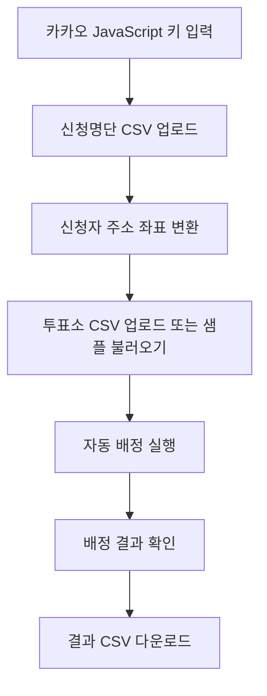

# 대전시 투표사무원 자동배정 시스템

> 주소 기반 거리 계산으로 투표사무원 배정을 더 빠르고 공정하게 처리하는 웹 프로토타입

[서비스 바로가기](https://qo3op.github.io/2026-daejeon/) · [GitHub 저장소](https://github.com/qo3op/2026-daejeon)

---

## 한눈에 보기

| 항목 | 내용 |
|---|---|
| 서비스 유형 | GitHub Pages 기반 정적 웹앱 |
| 주요 사용자 | 투표사무원 신청자, 선거 업무 관리자 |
| 핵심 기능 | 주소 좌표 변환, 거리 계산, 자동 배정, 결과 다운로드 |
| 배정 기준 | 신청자 주소와 투표소 좌표 간 직선거리 |
| 보안 방식 | API 키는 코드에 저장하지 않고 브라우저에만 저장 |

---

## 핵심 기능

### 1. 신청명단 CSV 업로드

신청자 명단을 CSV로 업로드하면 관리자 화면에서 바로 확인할 수 있습니다.

- 부서명
- 성명
- 직급
- 생년월일
- 연락처
- 주소
- 가능한 투표 유형
- 선호구, 선호동

위도와 경도 컬럼이 없어도 업로드할 수 있습니다.

---

### 2. 신청자 주소 좌표 변환

신청자의 주소를 카카오 주소 변환 API로 위도와 경도로 변환합니다.

```text
주소 → 위도 / 경도
```

변환된 좌표는 신청명단에 자동으로 반영되며, 좌표가 포함된 신청명단을 다시 다운로드할 수 있습니다.

---

### 3. 투표소 정보 관리

투표소 정보를 CSV로 업로드하거나 샘플 투표소를 불러올 수 있습니다.

투표소 데이터는 아래 정보를 기준으로 관리합니다.

- 구분
- 자치구
- 행정동
- 투표소명
- 주소
- 필요인원
- 위도
- 경도

---

### 4. 거리 기반 자동 배정

신청자와 투표소의 좌표를 기준으로 직선거리를 계산합니다.

```text
신청자 좌표 ↔ 투표소 좌표
```

가장 가까운 신청자를 우선 배정하며, 이미 배정된 신청자는 중복 배정하지 않습니다.

---

### 5. 배정 결과 확인

자동 배정 결과를 표로 확인할 수 있습니다.

결과에는 아래 정보가 포함됩니다.

- 구분
- 자치구
- 행정동
- 투표소명
- 배정자
- 부서
- 거리
- 배정사유

---

### 6. 결과 엑셀 다운로드

배정 결과는 엑셀에서 바로 열 수 있는 CSV 파일로 다운로드할 수 있습니다.

```text
투표사무원_배정결과_YYYY-MM-DD.csv
```

---

## 사용 흐름



---

## 자동 배정 로직

| 단계 | 처리 내용 |
|---|---|
| 1 | 투표소별 필요인원 확인 |
| 2 | 신청자와 투표소의 위도/경도 확인 |
| 3 | 좌표가 없는 데이터는 배정 대상에서 제외 |
| 4 | Haversine 공식으로 직선거리 계산 |
| 5 | 거리 가까운 신청자부터 배정 |
| 6 | 배정 완료 신청자는 중복 배정 방지 |
| 7 | 거리와 배정사유를 결과에 기록 |

---

## CSV 예시

### 신청명단

```csv
부서명,성명,직급,생년월일,연락처,주소,가능투표유형
총무과,홍길동,주무관,1990-01-01,01000000000,대전광역시 서구 둔산동,both
```

### 투표소

```csv
구분,자치구,행정동,투표소명,주소,필요인원,위도,경도
사전투표소,서구,둔산동,둔산1동 사전투표소,대전광역시 서구 둔산동,2,36.3504,127.3845
```

---

## 카카오 API 설정

카카오 JavaScript 키는 GitHub에 저장하지 않습니다.

서비스 화면 상단에서 키를 입력하고 `키 저장`을 누르면 현재 브라우저의 localStorage에만 저장됩니다.

카카오 개발자 콘솔에는 아래 Web 플랫폼 도메인을 등록합니다.

```text
https://qo3op.github.io
```

---

## 보안 포인트

| 항목 | 처리 방식 |
|---|---|
| 카카오 API 키 | 코드에 포함하지 않음 |
| 실제 신청자 명단 | GitHub 업로드 금지 |
| CSV / 엑셀 / PDF / HWP 파일 | `.gitignore`로 제외 |
| 배포 방식 | 정적 HTML만 GitHub Pages에 배포 |
| 개인정보 | 브라우저 메모리에서만 처리 |

---

## 발표용 요약

이 시스템은 투표사무원 신청자의 주소를 위도와 경도로 변환하고, 투표소와의 거리를 계산해 가장 가까운 신청자를 우선 배정하는 자동배정 프로토타입입니다.

관리자는 신청명단과 투표소 정보를 CSV로 업로드하고, 좌표 변환과 자동 배정을 실행한 뒤 결과를 CSV로 내려받을 수 있습니다.

API 키와 개인정보가 GitHub에 노출되지 않도록 설계했으며, 서버 없이 GitHub Pages에서 시연할 수 있습니다.

---

## 향후 개선 방향

- 실제 운영용 관리자 로그인
- 데이터베이스 저장 기능
- 엑셀 파일 직접 업로드 지원
- 선호지역 가중치 세분화
- 부서, 직급, 근무 이력 조건 반영
- 배정 결과 수동 수정 및 재배정
- 투표소별 배정 현황 대시보드
